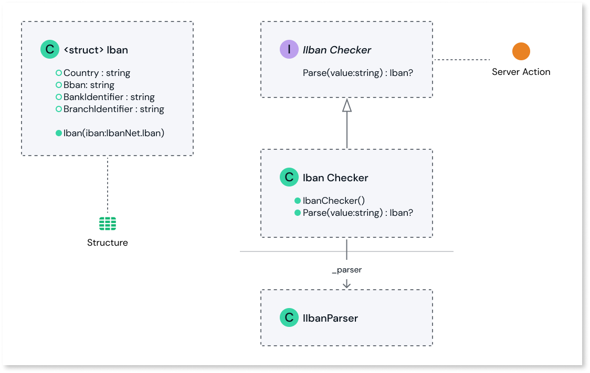

## IBAN (International Bank Account Number) checker: Basic version

### Prerequisites

* .NET 6.0 SDK installed.
* An IDE that supports building .NET 6 projects. For example, Visual Studio, Visual Studio Code, and Jet Brains Rider.
* Basic knowledge of C# programming concepts.

### Usage

1. Load the C# project file, `OutSystems.IbanChecker.csproj`, using a supported IDE.

    Files in the project:

    * **IIbanChecker.cs**: Defines a public interface named `IIbanChecker`, decorated with the `OSInterface` attribute. The interface has a single method named `Parse`, which takes an IBAN string value as input and returns an `Iban` struct. `Parse` is exposed as a server action to your ODC apps and libraries.

    * **IbanChecker.cs**: Defines a public class named `IbanChecker` that implements the `IIbanChecker` interface. The class is a convenient wrapper for the `IbanNet` library, an [open-source library](https://github.com/skwasjer/IbanNet) that provides functionality for parsing and validating IBANs. The class has a private field named `_parser`, which is an instance of the `IIbanParser` interface.

    * **Iban.cs** Defines a struct named `Iban`, decorated with the `OSStructure` attribute. The struct has four public properties: `Country`, `Bban`, `BankIdentifier`, and `BranchIdentifier`. `Iban` is exposed as a structure to your ODC apps and libraries.

    UML Diagram:

    

1. Edit the code to meet your use case. If your project requires unit tests, modify the examples found in `../OutSystems.IbanChecker.UnitTests/IbanCheckerTests.cs` accordingly.

1. Run the Powershell script `generate_upload_package.ps1` to generate `ExternalLibrary.zip`. Rename as required.

1. Upload the generated ZIP file to the ODC Portal. See the [External Logic feature documentation](https://www.outsystems.com/goto/external-logic) for guidance on how to do this.

_(Excerpted from the [main README of the External Libraries SDK](https://www.outsystems.com/goto/external-logic-readme), please refer to that document for additional guidance.)_